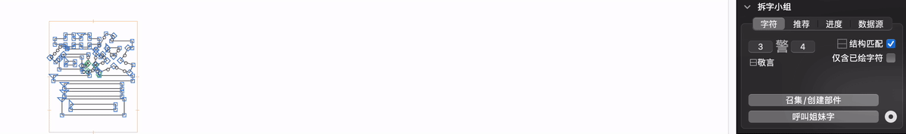
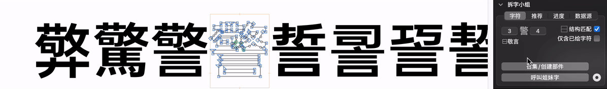

# Explosive Ordnance Disposal (拆字小组)

EOD is a Glyphs 3 plug-in designed to improve the efficiency of Chinese font designers. Provide easy-to-use glyph disassembly and analysis functions. 

## Function

### Siblings Glyphs
'Siblings Glyphs' is a group of CJK characters share a same radical or part.

Example:

	䧹 in (應 譍 噟 鷹)  <--- Siblings
	鳥 in (鷹 鴵 蔦 鵎)  <--- Also Siblings, and '鷹' in both groups.

EOD give you an buttom to randomly call out the siblings for quick edit or compare the glyphs.

#### Demo

### Disassemble the Glyph
Automatically disassemble the CJK characters into radical or part glyphs.

Example:

	'鷹' =
		_part.u5E7F-SfAL  <--- '广' as a part
		+ _part.u4EBB-LR  <--- '亻' as a part
		+ _part.u96B9-LR  <--- '隹' as a part
		+ _part.u9CE5-Si  <--- '鳥' as a part

#### Demo

## [ ...WIP ]

## License

Copyright 2020-2021 3type 三言.

Made possible with the [GlyphsSDK](https://github.com/schriftgestalt/GlyphsSDK) by Georg Seifert ([@schriftgestalt](https://github.com/schriftgestalt)) and Rainer Erich Scheichelbauer ([@mekkablue](https://github.com/mekkablue)).

* License

Licensed under the Apache License, Version 2.0 (the "License");
you may not use this file except in compliance with the License.
You may obtain a copy of the License at

<http://www.apache.org/licenses/LICENSE-2.0>

Unless required by applicable law or agreed to in writing, software
distributed under the License is distributed on an "AS IS" BASIS,
WITHOUT WARRANTIES OR CONDITIONS OF ANY KIND, either express or implied.
See the License for the specific language governing permissions and
limitations under the License.